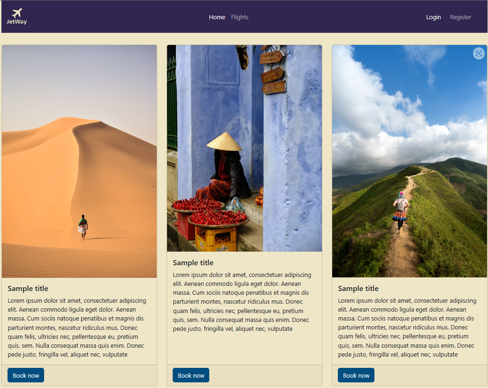

     

# JetWay

> Final Python FS course project based on FastAPI backend and React app as frontend.
> Live demo [_here_](https://jet-way.cc). <!-- If you have the project hosted somewhere, include the link here. -->

## Table of Contents

- [JetWay](#jetway)
  - [Table of Contents](#table-of-contents)
  - [General Information](#general-information)
  - [Technologies Used](#technologies-used)
      - [Backend](#backend)
      - [Database](#database)
      - [Frontend](#frontend)
  - [Features](#features)
  - [Screenshots](#screenshots)
  - [Setup](#setup)
    - [Prepare environment](#prepare-environment)
    - [Edit `docker-compose.yaml`](#edit-docker-composeyaml)
    - [Deploying the stack](#deploying-the-stack)
    - [Creating admin user](#creating-admin-user)
  - [API Documentation](#api-documentation)
  - [Usage](#usage)
  - [Project Status](#project-status)
  - [Room for Improvement](#room-for-improvement)
  - [Acknowledgements](#acknowledgements)
  - [Contact](#contact)
<!-- * [License](#license) -->


## General Information

- JetWay web app shows the very basic concept of flight booking and management functionality. It provides api and frontend for searching, browsing, editing and booking flights. As well as basic admin panel for managing users and their roles. 
- Main purpose of this project is to learn and understand the way various systems are built, integrated and can work with eachother, in this case MySQL database, Python based API and a React JS user interface. All of them mounted as Docker containers and accessed through Nginx reverse proxy.
- Aditional goal was to implement a relatively quick, simple and secure deployment using docker compose and docker secrets features.
- This app is far from being a real world app but it has more than enough features to show the underlying common concepts of a web app.
<!-- You don't have to answer all the questions - just the ones relevant to your project. -->


## Technologies Used
#### Backend
- Python - v3.11.4
- FastAPI - v0.100.0
- SQL Alchemy - v2.0.18
#### Database
- MySQL - v8.1.0
#### Frontend
- React - v18.2.0
- React Router - v6.14.2
- Axios - v1.4.0
- Bootstrap - v5.3
- Nginx - v1.25.1


## Features

List the ready features here:
- Browsing and searching flights by parameters.
- User role and permissions management.
- Flight management for airlines.
- Booked ticket browsing.
- Sensitive data encryption.
- User profile.

## Screenshots

Home page


Flights


Admin page


Airline flights


Customer tickets


<!-- If you have screenshots you'd like to share, include them here. -->

## Setup

The fastest and most convinient way to deploy JetWay is by using docker compose.

### Prepare environment

If you'd like to use docker secrets, Docker must be switched to a swarm mode: for more information please visit [_docker swarm_](https://docs.docker.com/engine/reference/commandline/swarm/) and [_docker secrets_](https://docs.docker.com/engine/swarm/secrets/).
```sh
$ docker swarm init
```

Create new directory which will hold the deployment files on your server.
```sh
$ mkdir jetway
```
Upload contents of `/deploy` folder to your newly created directory.

> Alternatively you can upload only `docker-compose.yaml` and `db_template.sql` then later create all the other files using favorite text editor of your choice. If you're planning to use regular environment variables `*.txt` files aren't needed.

**For use with docker secrets only:**

Create new or upload from `/deploy` folder following `*.txt` files:

 - `api_key.txt` - API secret key file.
 - `encryption_key.txt` - Encryption key for user's sensitive data.
 - `db_root_password.txt` - MySQL server root password.
 - `db_password.txt` - Database user password.

> Those files can be named differently.

**HTTPS**

JetWay sends and recieves sensitive users related data, to enhance security it is strongly advised to implement https on your server using SSL certificate signed by known authority.
For more details please visit [_LetsEncrypt_](https://letsencrypt.org/) and [_CertBot_](https://certbot.eff.org/).

Once you got certificate and private key files, store them in safe place with proper permissions on your server.

> For example on Ubuntu only members of `ssl-cert` group can access certificate files and keys which stored in directory owned by root user.

### Edit `docker-compose.yaml`

Open `docker-compose.yaml` for editing using nano, vim or any other text editor.
```sh
$ nano docker-compose.yaml
```
**For use with docker secrets**

Editing below variables will be enough:
- `MYSQL_DATABASE` - MySQL database name.
- `MYSQL_USER` - MySQL username.
- `DB_NAME` - Copy of `MYSQL_DATABASE` value.
- `DB_USER` - Copy of `MYSQL_USER` value.
- `API_URL` - Base URL of api server.
- `NGINX_APP_HOST` - Frontend app domain.
- `NGINX_API_HOST` - Backend api subdomain.

**For use without docker secrets** (Not recommended)

- `MYSQL_ROOT_PASSWORD` - MySQL root user password.
- `MYSQL_PASSWORD` - MySQL user password.
- `MYSQL_DATABASE` - MySQL database name.
- `MYSQL_USER` - MySQL username.
- `DB_NAME` - Copy of `MYSQL_DATABASE` value.
- `DB_USER` - Copy of `MYSQL_USER` value.
- `DB_PASSWORD` - Copy of `MYSQL_PASSWORD` value.
- `API_KEY` - API secret key.
- `ENCRYPTION_KEY` - Data encryptiomn key.
- `API_URL` - Base URL of api server.
- `NGINX_APP_HOST` - Frontend app domain.
- `NGINX_API_HOST` - Backend api subdomain.
- `NGINX_SERVER_CERT` - Path to server certificate inside container.
- `NGINX_SERVER_KEY` - Path to server private key inside container.

**Generating keys**

Recommended way to generate secret keys is to use openssl `rand` function.
For API secret key use:
```sh
$ openssl rand -hex 32
```
The output will be similar to:
```sh
9e6b2a9e4a83c9b069da5d46aa9fd958c3b4ea8d3eb400f876411c454910ff45
```
Copy the output to your `api_key.txt` or assign it to an `API_KEY` variable.

For user data encryption use:
```sh
$ openssl rand -base64 32
```
The output will be similar to:
```sh
EwGDL1p1pgCU1prUG98LGDXtHli/Agz9BjmtuwOXcNc=
```
Copy the output to `encryption_key.txt` or assign it to an `ENCRYPTION_KEY` variable.

Edit the following environment variables:

> Variables with `_FILE` suffix are for use with docker secrets, which are files that mounted to a special memory volume. Usually there is no need in editing those since they are mounted to a standard docker secrets path inside the container.

**Persistance of data**

By default data stored in a named volume `jetway_db` located in default docker volumes directory `/var/lib/docker/volumes` and mapped to a `/var/lib/mysql` inside db container. This way database is persistant independently of db container state. Of course volume can be renamed or remapped to suit your needs.

**External access to database**

By default there you can connect to MySQL server directly from outside by using any compatible client. To prevent outside access:

Comment out:
```yaml
ports:
  - '3306:3306'
```

Uncomment:
```yaml
expose:
  - 3306
```
**Secrets files**

In the `secrets:` part of `docker-compose.yaml` verify names and paths of secret containing files. Pay special attention to server certificate and private key. If they are kept in different location than `docker-compose.yaml` please specify full path including file name for example: `/root/certificates/cert.pem`.

**Certificate and private key**

If docker secrets aren't used, map a volume to certificates location:
Uncomment:
```yaml
volumes:
    - /my_super_secret_directory/:/etc/nginx/ssl
```
Replace `/my_super_secret_directory/` with real path on your server.

### Deploying the stack

Once everything is ready, run the following from directory containing `docker-compose.yaml`
```sh
$ docker compose up -d
```
This will pull all necessary images and create containers using settings you defined at previous stage.
When the proccess is finished ensure all containers are up and running by using:
```sh
$ docker container ls
```
Under `NAMES` column you should see a list of containers including:
- `jetway-db`
- `jetway-api`
- `jetway-ui`
- `jetway-proxy`

If so, the app should be now accessible via browser at `https://your_app_domain`

### Creating admin user

If everything is up and running, the only thing left now is to create first admin user:

```sh
$ docker exec -it jetway-api python create_admin.py 
```
You will be asked to enter personal information: username, password, email, first name and last name. Upon successfull creation, you can browse to app login page and try to login.

## API Documentation

Because of FastAPI being used, it comes with automaticaly updated Swagger UI detailed documentation on every api endpoint including posibility to try and send various requests.
Just browse to `https://your_api_domain/docs`.

>FastAPI also provides alternative ReDoc based documentation available on `https://your_api_domain/redoc`.

## Usage

 - App can be accessed anonymously but guest visitors cannot book flights, only searching and browsing available.
 - Users can register themselves via register form. Every new registered user automatically assigned  a customer role.
 - Customers can see and delete their purchased tickets. 
 - Customers with empty profile data without payment card cannot buy tickets.
 - Administrator can assign any role to any other user from admin panel.
 - User with airline permission can add or edit flights associated with airline he or she represents.

## Project Status

Project is: _in progress_
>Although it is ready for submission, I'll still use it as playground and add new features and improvements to it.

## Room for Improvement

For further improvement improvement:
- Optimize SQL db interactions to reduce number of database queries.
- Optimize service "facades" layer by using more custom Pydantic function validations.
- Find and extract some commonly used functions that possibly left to reduce amount of code and keep it DRY.

To do:
- [ ] Add pricing.
- [ ] Add user deactivation.
- [ ] Add email verification.
- [ ] Add password reset feature by sending email with token link.
- [ ] Add dual factor authentication.
- [ ] Add login with social networks.
- [ ] Add profile pictures.
- [ ] Add airline logos.

## Acknowledgements

- API in the project was based on [FastAPI documentation](https://fastapi.tiangolo.com/) by [@tiangolo](https://twitter.com/tiangolo).
- React documentation and tutorials from [react.dev](https://react.dev/learn).
- Styling and apearance by [Bootstrap](https://getbootstrap.com/)
- Special thanks to [John Bryce](https://www.johnbryce.co.il/) colledge. 

## Contact

Created by [@borisp](mailto:borisftz@gmail.com) - feel free to contact me!


<!-- Optional -->
<!-- ## License -->
<!-- This project is open source and available under the [... License](). -->

<!-- You don't have to include all sections - just the one's relevant to your project -->